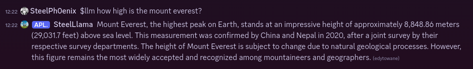

# unreasonable-llama-discord

Discord bot plugged directly to a locally hosted LLM!

[](https://github.com/SteelPh0enix/unreasonable-llama-discord/actions/workflows/check-code.yml)

## Description

This bot is basically a Discord front-end for llama.cpp built-in server.



## Features

- Chatting with LLM, with persistent chat memory
- Message history management
- System prompt and inference parameters customization
- Rich bot customization options

Use `$llm-help` command to bot's help.

### Progress (v0.2)

🟥 feature not implemented yet
🟧 feature in progress
🟩 feature done

- Core app
    - 🟩 CLI arguments parsing (via argparser)
    - 🟩 Configuration loading (via bot_config)
    - 🟩 Creating default configuration, if nonexistent
    - 🟧 Starting up Discord client with required config and dependencies

- Global bot configuration
    - 🟩 Storing and reading config from file (TOML <-> JSON (dict))
    - 🟩 Utilities for creating default configuration file

- Bot database
    - 🟧 Storing user configuration
        - 🟩 Storing/fetching custom prompts
        - 🟥 Storing/fetching custom generation settings
    - 🟩 Storing/fetching user conversations

- Discord client
    - 🟩 Handling requests for LLM inference
        - 🟩 Chained responses (first message responds to user, split responds to previous message)
    - 🟥 Handling user configuration requests
        - 🟥 Printing current user configuration
        - 🟥 Setting user configuration
    - 🟧 Printing help
        - 🟩 Printing bot's help
        - 🟥 Printing LLM parameters help
        - 🟩 Printing commands list
    - 🟩 Removing messages on user reaction

- Interface between llama.cpp server and Discord client
    - 🟩 Performing streamed LLM inference with user arguments
        - 🟩 Message splitting for user-defined length
            - 🟩 Fixing the code blocks between splits
        - 🟥 Handling user configuration options for inference

## Deployment

First, you need to grab a quantized GGUF model of an LLM you want to run, and [`llama-server`](https://github.com/ggerganov/llama.cpp/tree/master/examples/server), which is a part of [`llama.cpp`](https://github.com/ggerganov/llama.cpp).

Quantized GGUF can either be downloaded directly from [HuggingFace](https://huggingface.co/), or created manually with `llama.cpp`.
I recommend reading `llama.cpp` documentation for more details about manual quantization. If you aren't sure what to do, i recommend getting Llama-3 or Qwen2 model from [QuantFactory on HuggingFace](https://huggingface.co/QuantFactory), or similar reputable quantizer.

### Note about quantizations

The "rule of thumb" is that "higher" quantization - better the model, but in practice i recommend using Q4, Q5 or Q6 models if you aren't sure which to choose, depending on your hardware capabilities. It's best to use models of size which will fit your GPU's VRAM, assuming you're going to be using one, which is the recommended way of using `llama.cpp`.

`llama.cpp` can either be installed from binaries (check your system's package manager, or use Github Releases to download one), or compiled manually. In some cases manual compilation will be required (lack of pre-existing binaries for your OS or platform, i.e. ROCm). I personally use a bunch of scripts to simplify this process, which is available in two versions: [Linux](https://gist.github.com/SteelPh0enix/760107a1749df8203fd7b0943fcb5976) and [Windows](https://gist.github.com/SteelPh0enix/8651ed5a6ea571b1cd11b8c9fa47ac47). **It's recommended to read build instructions of `llama.cpp` even when using those scripts, as they are very much customized for my platform and using them 1:1 may result in very suboptimal experience. They should preferably be treated as a template for your own scripts.**

Linux script contains parametrized invocation of `llama-server` that you can use as a template for running it yourself.

Assuming the server is running at `llama-ip:llama-port`, and your discord bot's API key is `MyAPIKey`, you can run the `unreasonable-llama-discord` bot as following:

```bash
cd unreasonable-llama-discord
poetry install # must be done once to create virtualenv and set up dependencies for the bot
export LLAMA_CPP_SERVER_URL="http://llama-ip:llama-port/"
export UNREASONABLE_LLAMA_DISCORD_API_KEY="MyAPIKey"
poetry run python unllamabot
```

The bot should perform a single request to `/health` endpoint at the start, and if everything is configured correctly it should show loaded model's path in the activity and start responding to queries.
